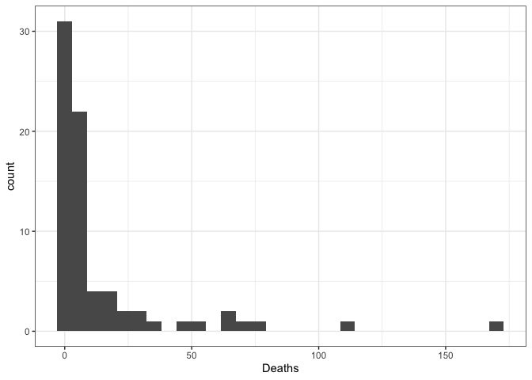
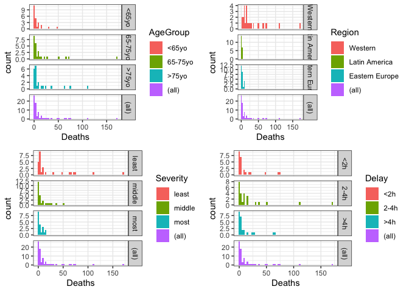
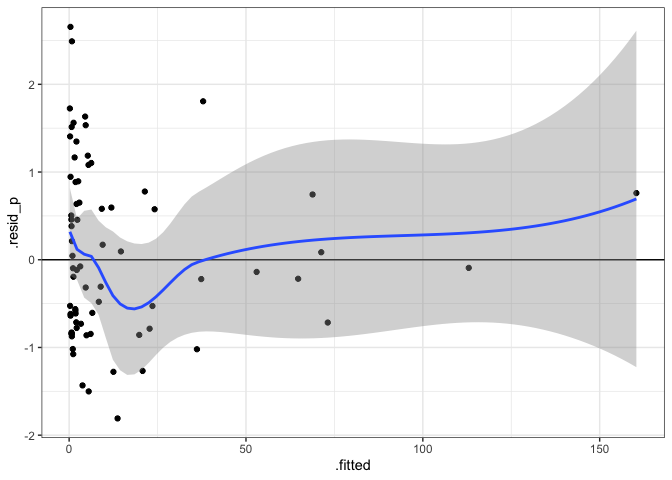
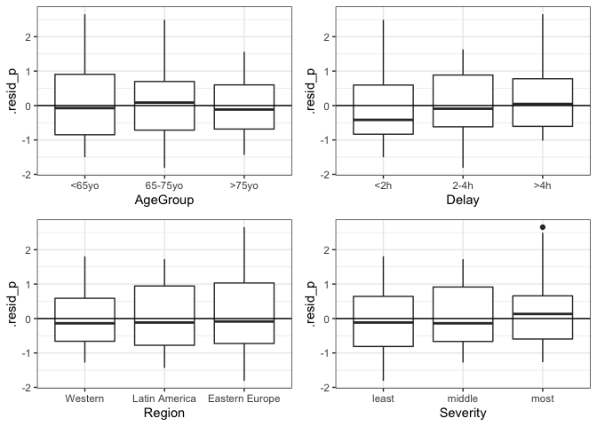
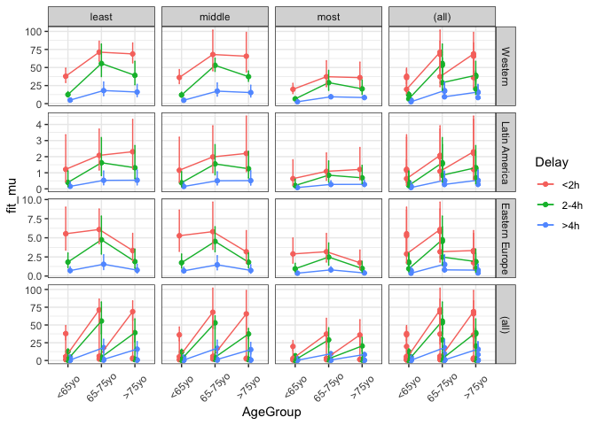

### Introduction

This study aimed to identify patient characteristics that might be
predictive for death from heart attack using a generalized linear
modeling approach.

We are using data from the “heart” dataset ( glm2 package \[1\]) which
holds data on 16949 people who experienced a heart attack. The data is
obtained from a double blind randomised clinical trial. Each categorical
explanatory variable has 3 categories and the following meanings:
AgeGroup groups patients according to their age; Delay – according to
time from the beginning of the attack to the start of treatment;
Severity indicates the severity of the condition during the attack
according to the Killip’s classification; Region indicates the
geographical region where the patient was undergoing treatment.

### Methods

The presence of outliers in the data was tested using Cleveland diagrams
\[2\]. In order to assess the correlation between the variables, an
analysis was carried out using a generalized linear model \[3\]. The
conditions for the applicability of the method include: 1. The
independence of the observations (ensured by the data collection
method); 2. Absence of overdispersion; 3. Homogeneity of model
residuals; 4. Non-collinearity of the explanatory variables (checked by
calculating the variance inflation factors \[4\]). The simplification of
the initial model was carried out using the Akaike information criterion
(AIC) \[5\]. The post hoc analysis was performed according to the
Tukey’s test \[6\]. The calculations were performed in the R \[7,8\]
environment using the packages: ggplot2 \[9\], cowplot \[10\] - for
plotting graphs, car \[11\] - for data analysis, emmeans \[12\] - for
post hoc analysis, glm2 \[13\] - for constructing a generalized linear
model, the Ben Bolker function was used to check for overdispersion
\[14\].

### Calculations

``` r
library(glm2)
library(car)
library(ggplot2)
library(cowplot)
library(emmeans)
theme_set(theme_bw())

data <- heart
nrow(data) #74 observations
colSums(is.na(data)) #no missing values

# let's rename categories of the variables for better readability
data$AgeGroup <- factor(data$AgeGroup, levels = c(1,2,3), labels = c('<65yo', '65-75yo', '>75yo'))
data$Severity <- factor(data$Severity, levels = c(1,2,3), labels = c('least', 'middle', 'most'))
data$Region <- factor(data$Region, levels = c(1,2,3), labels = c('Western', 'Latin America', 'Eastern Europe'))
data$Delay <- factor(data$Delay, levels = c(1,2,3), labels = c('<2h', '2-4h', '>4h'))

table(data$AgeGroup)
table(data$Severity)
table(data$Delay)
table(data$Region) #the numbers of observations refered to different categories of the factors are close

#outliers
gg_dot <- ggplot(data, aes(y = 1:nrow(data))) + geom_point()
gg_outl <- plot_grid(gg_dot + aes(x = AgeGroup), gg_dot + aes(x = Severity),
          gg_dot + aes(x = Region), gg_dot + aes(x = Delay), nrow = 1)

# response distribution
gg_distr <- ggplot(data, aes(x = Deaths)) + geom_histogram(bindwith = 3)
mean(data$Deaths == 0) # proportion of zeros

#response distributions on different categories of factors
g_diag1 <- ggplot(data, aes(Deaths, fill = AgeGroup)) + geom_histogram(binwidth = 3) + facet_grid(AgeGroup ~ ., margins = TRUE, scales = 'free')
g_diag2 <- ggplot(data, aes(Deaths, fill = Region)) + geom_histogram(binwidth = 3) + facet_grid(Region ~ ., margins = TRUE, scales = 'free')
g_diag3 <- ggplot(data, aes(Deaths, fill = Severity)) + geom_histogram(binwidth = 3) + facet_grid(Severity ~ ., margins = TRUE, scales = 'free')
g_diag4 <- ggplot(data, aes(Deaths, fill = Delay)) + geom_histogram(binwidth = 3) + facet_grid(Delay ~ ., margins = TRUE, scales = 'free')

grid_Deaths <- plot_grid(g_diag1, g_diag2, g_diag3, g_diag4, nrow = 2)

#collinearity of explanatory variables graphical check (= the continuous predictor has different ranges for different categories of the discrete predictors)
#continuous explanatory variable - Patients
gg_box <- ggplot(data, aes(y = Patients)) + geom_boxplot()
gg_coll <- plot_grid(gg_box + aes(x = AgeGroup), gg_box + aes(x = Delay), 
          gg_box + aes(x = Region), gg_box + aes(x = Severity)) #number of patients varies for Region and Severity, i.e. there might be collinearity

#building a model for poisson distributed response. "Patients" - a confounding variable (the more patients - the more deaths)
mod_poi_vif <- glm(Deaths ~ Patients + AgeGroup + Severity + Region + Delay, data = data, family = 'poisson')
vif(mod_poi_vif) # "Patients" is collinear and to be dropped out
mod_poi_vif <- update(mod_poi_vif, .~. -Patients)
vif(mod_poi_vif) #no collinearity

mod_poi_0 <- glm(Deaths ~ AgeGroup * Severity * Region * Delay, data = data, family = 'poisson')
length(coef(mod_poi_0)) #81 coefficients in this model, we need to simplify it

# comparing models with different combinations of predictors by AIC
zero_poi <- glm(Deaths ~ 1, data = data, family = 'poisson')

mod_poi <- auto.backward <- step(mod_poi_0, direction = "backward", scope=list(lower=zero_poi, upper=mod_poi_0)) #final model

#the function for overdispersion check
overdisp_fun <- function(model) {
    rdf <- df.residual(model)  # degrees of freedom N - p
    if (inherits(model, 'negbin')) rdf <- rdf - 1 
    rp <- residuals(model,type='pearson') # Pearson residuals
    Pearson.chisq <- sum(rp^2) 
    prat <- Pearson.chisq/rdf 
    pval <- pchisq(Pearson.chisq, df=rdf, lower.tail=FALSE) # significance level
    c(chisq=Pearson.chisq,ratio=prat,rdf=rdf,p=pval)        # the result output
}
overdisp_fun(mod_poi) #no overdispersion

Anova(mod_poi) #significant interaction between AgeGroup:Delay and AgeGroup:Region, for the latest Pr is close to the threshold 

# applicability conditions check
#homogeneity of the model residuals check
mod_poi_diag <- data.frame(.fitted = predict(mod_poi, type = 'response'), .resid_p = residuals(mod_poi, type = 'pearson'))
gg_resid_p <- ggplot(mod_poi_diag, aes(y = .resid_p, x = .fitted)) + geom_point() + geom_hline(yintercept = 0) + geom_smooth(method = 'loess') 

#graphs of residuals against the predictors
mod_poi_diag <- data.frame(data,mod_poi_diag) 
res <- ggplot(mod_poi_diag, aes( y = .resid_p)) + geom_boxplot() + geom_hline(yintercept = 0)
res_grid <- plot_grid(res + aes(x = AgeGroup), res + aes(x = Delay), res + aes(x = Region), res + aes(x = Severity), nrow = 2) #no heteroskedasticity

#post hoc test to find out which exact categories of the factors interact, using emmeans
#post hoc for AgeGroup*Delay
marginal <- emmeans(mod_poi, ~ AgeGroup*Delay)
tukey <- pairs(marginal, adjust='tukey')
t <- data.frame(tukey)
#post hoc for AgeGroup*Region
marginal1 <- emmeans(mod_poi, ~ AgeGroup*Region)
tukey1 <- pairs(marginal1, adjust='tukey')
t1 <- data.frame(tukey1)
t1$p.value <- round(t1$p.value, 5)
t1 <- data.frame(t1$contrast, exp(t1$estimate), 1/exp(t1$estimate), t1$estimate, t1$p.value)
t1 <- t1[with(t1, order(t1$t1.contrast)), ]
t1 <- t1[t1$t1.p.value < 0.05,]
nrow(t1) #23 out of 36 combinations are statistically significant

# Visualisation of the results
new_data <- expand.grid(AgeGroup = levels(data$AgeGroup),Delay = levels(data$Delay), Severity = levels(data$Severity), Region = levels(data$Region))
X <- model.matrix(~ AgeGroup + Delay + Region + Severity + AgeGroup:Region + AgeGroup:Delay , data = new_data)
b <- coef(mod_poi)
new_data$fit_eta <- X %*% b
new_data$se_eta <- sqrt(diag(X %*% vcov(mod_poi) %*% t(X)))
log_back <- function(x) exp(x)
new_data$fit_mu <- log_back(new_data$fit_eta)
new_data$lwr <- log_back(new_data$fit_eta - 2 * new_data$se_eta)
new_data$upr <- log_back(new_data$fit_eta + 2 * new_data$se_eta)

pos <- position_dodge(width = 0.2)

gg_eta <- ggplot(data = new_data, aes(x = AgeGroup, y = fit_eta, ymin = fit_eta - 2 * se_eta, ymax = fit_eta + 2 * se_eta, colour = Delay)) + geom_point(position = pos)  + geom_line(aes(group = Delay), position = pos) + facet_grid( Region ~ Severity , margins = TRUE, scales = 'free') + geom_errorbar(width = 0.1, position = pos) + theme(axis.text.x = element_text(angle = 45, vjust = 0.5))

gg_mu <- ggplot(data = new_data, aes(x = AgeGroup, y = fit_mu, ymin = lwr, ymax = upr, colour = Delay)) + geom_point(position = pos)  + geom_line(aes(group = Delay), position = pos) + facet_grid( Region ~ Severity , margins = TRUE, scales = 'free') + geom_errorbar(width = 0.1, position = pos) + theme(axis.text.x = element_text(angle = 45, vjust = 0.5))
```

The data is well-balanced among categories of the variables AgeGroup,
Severity, Delay, Region respectively:

    ## 
    ##   <65yo 65-75yo   >75yo 
    ##      24      27      23

    ## 
    ##  least middle   most 
    ##     27     27     20

    ## 
    ##  <2h 2-4h  >4h 
    ##   24   25   25

    ## 
    ##        Western  Latin America Eastern Europe 
    ##             27             21             26

Since the response variable is a count and it’s distributed as a small
number of large values (figures 1, 2) and the proportion of zero values
is at 14%, a generalized linear model for a variable with a Poisson
distribution was used as the initial model.

**Figure 1** Response variable distribution (Deaths)



**Figure 2** Response variable distribution (Deaths) among categories of
the factors



After simplifying the original model using the Akaike information
criterion, we obtain a model with significant interactions between the
AgeGroup and Delay variables, as well as AgeGroup and Region (Table 1).

**Table 1** Final simplified model

    ## Analysis of Deviance Table (Type II tests)
    ## 
    ## Response: Deaths
    ##                 LR Chisq Df           Pr(>Chisq)    
    ## AgeGroup             185  2 < 0.0000000000000002 ***
    ## Severity             597  2 < 0.0000000000000002 ***
    ## Region              1463  2 < 0.0000000000000002 ***
    ## Delay                 97  2 < 0.0000000000000002 ***
    ## AgeGroup:Region       11  4              0.03226 *  
    ## AgeGroup:Delay        19  4              0.00087 ***
    ## ---
    ## Signif. codes:  0 '***' 0.001 '**' 0.01 '*' 0.05 '.' 0.1 ' ' 1

Testing for the applicability conditions of the model did not reveal any
significant violations. There was no overdispersion (Table 2).

**Table 2** Testing the model for overdispersion

    ##     chisq     ratio       rdf         p 
    ## 71.119493  1.247710 57.000000  0.098872

Insignificant signs of non-linearity in the distribution of the model
residuals were identified, which may indicate that not all sources of
non-linearity are taken into account in the model (Figure 3).

**Figure 3** The residual plot



The residuals are distributed homogeneously against the explanatory
variables (Figure 4).

**Figure 4** Graphs for the dependence of the residuals on the
predictors



## Results and discussion

According to the obtained model, the nature of the dependence of the
probability of dying from a heart attack will be different for different
age groups of patients whose treatment was started with different
delays, as well as for different age groups of patients living in
different regions (Figure 5).

**Figure 5** Visualisation of the interaction of factors in the model
(in the scale of the response)



A post hoc analysis based on the data for patients of different age
groups who were treated with different delays revealed that 14 factor
combinations out of 36 differ statistically significantly (Table 3).

**Table 3** The results of post hoc analysis of the AgeGroup and Delay
factors interaction (different levels of factors only)\*

    ##                        t.contrast exp.t.estimate. t.estimate
    ## 23    (<65yo 2-4h) - (>75yo 2-4h)         0.45504   -0.78736
    ## 22  (<65yo 2-4h) - (65-75yo 2-4h)         0.27782   -1.28078
    ## 31       (>75yo 2-4h) - <65yo >4h         4.00738    1.38814
    ## 33       (>75yo 2-4h) - >75yo >4h         1.74510    0.55681
    ## 11 (65-75yo <2h) - (65-75yo 2-4h)         0.44444   -0.81093
    ## 13      (65-75yo <2h) - <65yo >4h         2.91719    1.07062
    ## 29 (65-75yo 2-4h) - (65-75yo >4h)         2.19328    0.78540
    ## 28     (65-75yo 2-4h) - <65yo >4h         6.56367    1.88155
    ## 30     (65-75yo 2-4h) - >75yo >4h         2.85829    1.05022
    ## 4      <65yo <2h - (65-75yo 2-4h)         0.29126   -1.23352
    ## 34      <65yo >4h - (65-75yo >4h)         0.33415   -1.09615
    ## 18       >75yo <2h - (>75yo 2-4h)         0.60917   -0.49566
    ## 17     >75yo <2h - (65-75yo 2-4h)         0.37192   -0.98907
    ## 19          >75yo <2h - <65yo >4h         2.44117    0.89248
    ##    t.p.value
    ## 23   0.04848
    ## 22   0.00000
    ## 31   0.00002
    ## 33   0.00025
    ## 11   0.00000
    ## 13   0.00320
    ## 29   0.00000
    ## 28   0.00000
    ## 30   0.00000
    ## 4    0.00001
    ## 34   0.00215
    ## 18   0.00159
    ## 17   0.00001
    ## 19   0.04533

-   The results are averaged over the Severity and Region levels, and
    are shown in log scale (t.estimate) and in response scale
    (exp.t.estimate).

## Inference

The analysis revealed statistically significant interactions between the
age group factor and how soon after a heart attack treatment was
obtained (likelihood ratio test, p = 0.001). Similarly, between the age
group factor and the region where the patient was treated (p = 0.03,
which is close to the threshold value). The most significant differences
were observed between the following combinations of factors of age group
and time of treatment after a heart attack:

-   The prognosis of survival for patients from the 65-75 age category
    who were treated within 2-4 hours after the attack was significantly
    less favorable than for patients younger than 65 years who waited
    for help for more than 4 hours - 6.6 times less favourable (Tukey’s
    test, p \< 10<sup> − 10</sup>); less than 2 hours - 3.4 times less
    favourable (p \< 10<sup> − 5</sup>); 2-4 hours - 3.6 times less
    favourable (p \< 10<sup> − 5</sup>). Also, such patients died 2.7
    times more often than patients older than 75 years, but who were
    treated in the first 2 hours (p \< 10<sup> − 4</sup>) and 2.9 times
    more often if they waited 4 hours (p \< 10<sup> − 5</sup>);

-   If patients from the 65-75 age group were treated no later than 2
    hours after the attack, the survival rate increased 2.3 times
    compared to the same age patients who waited for treatment 2-4 hours
    (Tukey’s test, p \< 10<sup> − 10</sup>);

-   Older than 75 years old patients, whose treatment started after 2-4
    hours, died 4 times more often than patients younger than 65 years
    with a delay in treatment of more than 4 hours (Tukey’s test, p \<
    10<sup> − 4</sup>)

-   Patients aged 65-75, whose treatment started later than after 4
    hours, died 3 times more often than patients younger than 65 with a
    similar delay in treatment (Tukey’s test, p = 0.002);

-   Patients younger than 65 with a delay in treatment of more than 4
    hours, survived 3 times more often than patients aged 65-75 with a
    similar delay (Tukey’s test, p = 0.002), and a delay of less than 2
    hours (p = 0.003).

The remaining combinations of factors gave survival rate differences of
no more than times two, or the significance levels of comparisons were
critically close to the threshold 0.05.

## References

\[1\]. ASSENT-2 Investigators, 1999; Marschner, 2011

\[2\]. Chang W. R Graphics Cookbook, 2nd edition ISBN-10: 1491978600 URL
<https://r-graphics.org>

\[3\]. Wikipedia contributors. (2021, March 20). Generalized linear
model. In Wikipedia, The Free Encyclopedia. Retrieved 19:38, May 16,
2021, from <https://en.wikipedia.org/wiki/Generalized_linear_model>
\[3\*\]. <https://rcompanion.org/handbook/J_01.html>

\[4\]. (2018) Detecting Multicollinearity Using Variance Inflation
Factors. URL <https://online.stat.psu.edu/stat462/node/180/Factor>
inflation testing

\[5\]. Wikipedia contributors. (2021, March 20). Akaike information
criterion. In Wikipedia, The Free Encyclopedia. Retrieved 19:38, May 16,
2021, from <https://en.wikipedia.org/wiki/Akaike_information_criterion>

\[6\]. Wikipedia contributors. (2021, March 20). Tukey range test. In
Wikipedia, The Free Encyclopedia. Retrieved 19:38, May 16, 2021, from
<https://en.wikipedia.org/wiki/Tukey%27s_range_test>

\[7\]. R Core Team. (2018). R: A language and environment for
statistical computing. R Foundation for Statistical Computing, Vienna,
Austria. URL <http://www.R-project.org/>.

\[8\]. RStudio (2018). RStudio: Integrated development environment for R
(Version 1.1.453). Boston, MA. URL <http://www.rstudio.org/>

\[9\]. Wickham, H. (2016). ggplot2: elegant graphics for data analysis.
Springer.

\[10\]. Wilke C. (2020) Introduction to cowplot. package version 1.1.1
URL
<https://cran.r-project.org/web/packages/cowplot/vignettes/introduction.html>

\[11\]. Fox, J. and Weisberg, S. (2019). Functions to Accompany. package
version 3.0-10. URL <http://CRAN.R-project.org/package=car>

\[12\]. (2021) Interaction analysis in emmeans. package version 1.6.0
URL
<https://cran.r-project.org/web/packages/emmeans/vignettes/interactions.html>

\[13\]. (2018) glm2: Fitting Generalized Linear Models. package version
1.2.1 URL <https://cran.r-project.org/web/packages/glm2/index.html>

\[14\]. (2021) <http://bbolker.github.io/mixedmodels-misc/glmmFAQ.html>.
