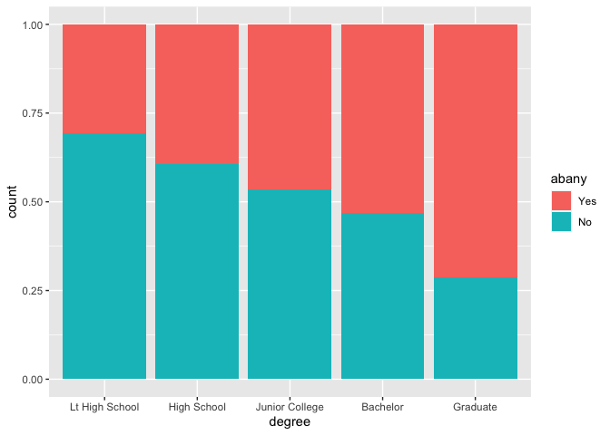
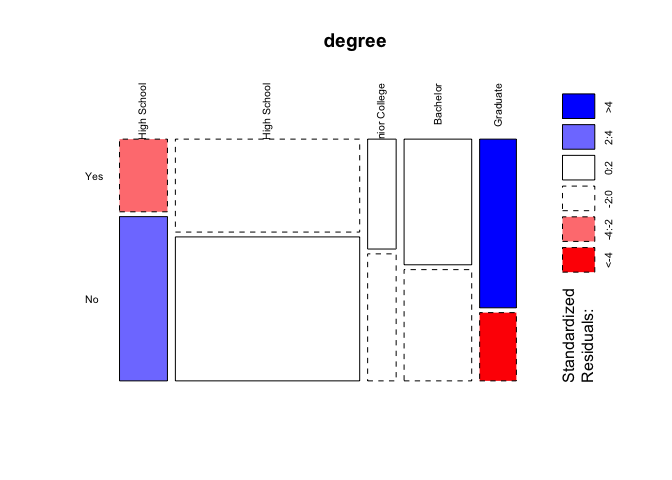
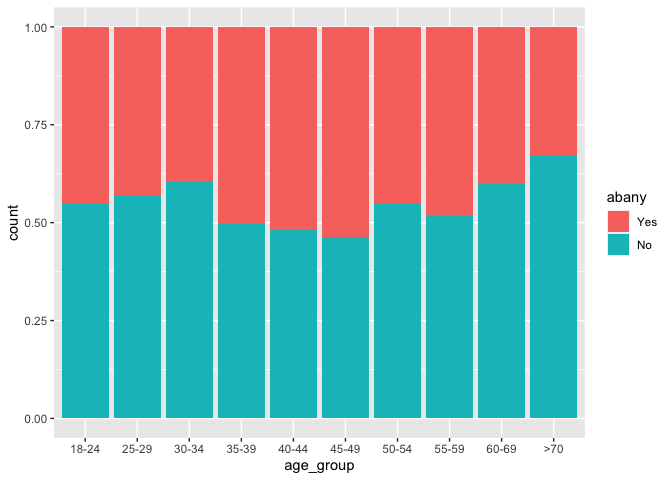
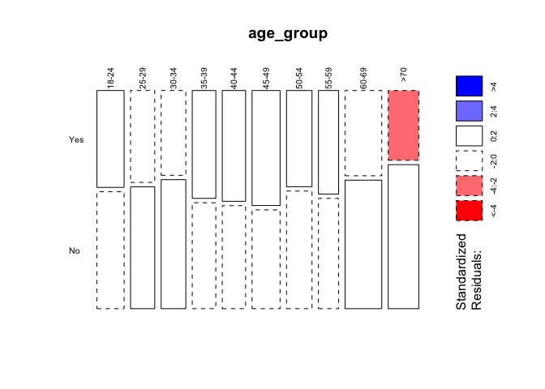
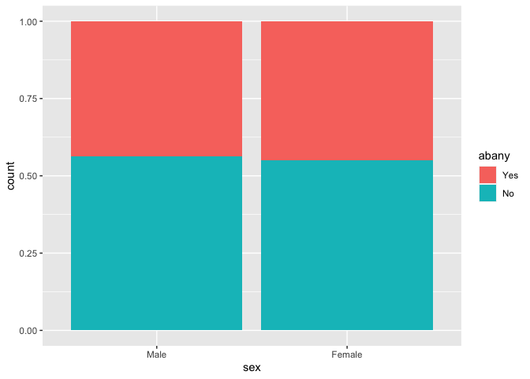
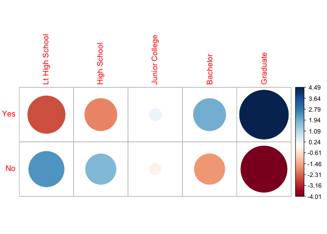
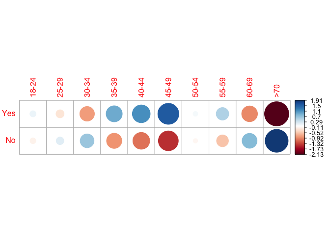
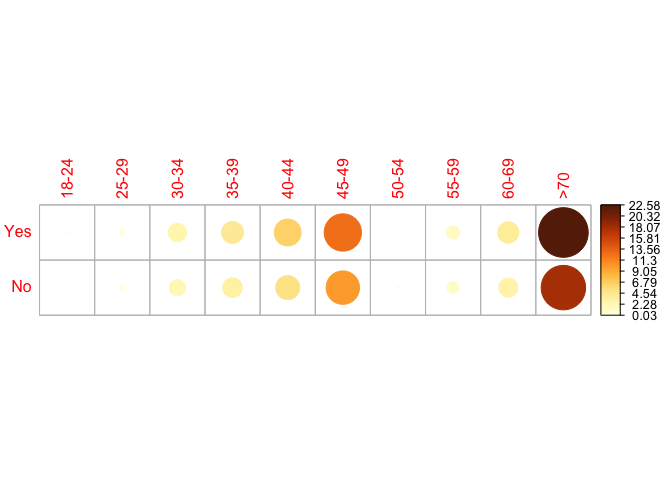
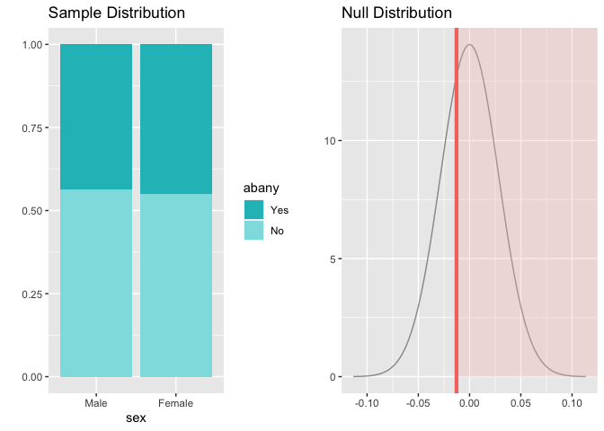

### Setup

#### Load packages

``` r
library(ggplot2)
library(dplyr)
library(statsr)
library(graphics)
library(corrplot)
```

#### Load data

``` r
load("gss.Rdata")
```

------------------------------------------------------------------------

### Part 1: Data

The [General Social
Survey](https://www.norc.org/Research/Projects/Pages/general-social-survey.aspx)
(GSS) is a sociological survey created and regularly collected since
1972 by the National Opinion Research Center at the University of
Chicago. It is funded by the National Science Foundation. The GSS
collects information and keeps a historical record of the concerns,
experiences, attitudes, and practices of residents of the United States.

The target population of the GSS is adults (18+) living in households in
the United States. The GSS sample is drawn using an area probability
design that randomly selects respondents in households across the United
States to take part in the survey. Respondents that become part of the
GSS sample are from a mix of urban, suburban, and rural geographic
areas. Participation in the study is strictly voluntary.

The survey is conducted face-to-face with an in-person interview by NORC
at the University of Chicago. Computer-assisted personal interviewing
(CAPI) began in the 2002 GSS. The survey was conducted every year from
1972 to 1994 (except in 1979, 1981, and 1992). Since 1994, it has been
conducted every other year. As of 2014, 30 national samples with 59,599
respondents and 5,900+ variables have been collected. \[1\]

##### Generalisability

The sample from the GSS should be representative of the target
population as respondents were randomly selected. Methodology used for
the sample collection was designed to neutralise the possible sources of
bias, specifically “voluntary” bias. Researches weighted observations.

##### Causality

As the GSS is an observational study with no random assignment, any
causal relationships of the variables cannot be inferred.

------------------------------------------------------------------------

### Part 2: Research questions

Abortions have always been an acute and controversial topic. Considering
the recent news on the near-total abortion ban in Poland and Texas, it
is probable that more changes regarding women’s rights are to be
expected. I would like to look into the structure of the public opinion
on abortions: namely, whether there is a correlation between
respondents’ opinions and their education level and also their age
groups. Respondents were asked whether or not they think it should be
possible for a pregnant woman to obtain a legal abortion if the woman
wants it for any reason.

##### 2.1. Is there a correlation between respondent’s education level and their opinion on the topic and which education level groups in population have stronger opinions?

Variables used: degree - respondent’s highest degree (categorical with 5
levels): Less than high school High school Associate/junior college
Bachelor’s Graduate

abany - respondent’s opinion on abortion if woman wants for any reason
(categorical with 2 levels).

##### 2.2. Is there a correlation between respondent’s age group and their opinion on the topic and which age groups in population have stronger opinions?

Variables used: age - respondent’s age (numerical), abany - respondent’s
opinion on abortion if woman wants for any reason (categorical with 2
levels).

##### 2.3. Is there a correlation between respondent’s gender and their opinion on the topic?

Variables used: respondent’s sex (categorical with 2 levels), abany -
respondent’s opinion on abortion if woman wants for any reason
(categorical with 2 levels).

------------------------------------------------------------------------

### Part 3: Exploratory analysis

#### 3.1. Education level group and opinion on abortions

Let’s see the number of available observations, that have all variables
of interest presented, by year and by education level groups:

``` r
abor_edu <- select(gss, year, abany, degree, sex) %>%
  # Filter out NAs
  filter(is.na(abany) == FALSE, is.na(degree) == FALSE, is.na(sex) == FALSE)

table(abor_edu$year)
```

    ## 
    ## 1977 1978 1980 1982 1983 1984 1985 1987 1988 1989 1990 1991 1993 1994 1996 1998 
    ## 1426 1444 1366 1705 1485 1393 1456 1691  919  968  864  931  993 1912 1798 1761 
    ## 2000 2002 2004 2006 2008 2010 2012 
    ## 1746  896  847 1925 1290 1223 1242

``` r
table(abor_edu$degree)
```

    ## 
    ## Lt High School    High School Junior College       Bachelor       Graduate 
    ##           6292          16518           1766           4490           2215

Contingency table for the variables of interest:

``` r
cont_t_edu <- table(abor_edu$abany, abor_edu$degree)
cont_t_test_edu <- table(abor_edu$degree, abor_edu$degree)

cont_t_edu
```

    ##      
    ##       Lt High School High School Junior College Bachelor Graduate
    ##   Yes           1654        6561            784     2401     1356
    ##   No            4638        9957            982     2089      859

Let’s look into the most recent data available in our dataset which was
the year of 2012:

``` r
abor_edu_2012 <- abor_edu[abor_edu$year == 2012,]

table(abor_edu_2012$degree)
```

    ## 
    ## Lt High School    High School Junior College       Bachelor       Graduate 
    ##            163            627             97            230            125

``` r
table(abor_edu_2012$degree,abor_edu_2012$abany)
```

    ##                 
    ##                  Yes  No
    ##   Lt High School  50 113
    ##   High School    246 381
    ##   Junior College  45  52
    ##   Bachelor       122 108
    ##   Graduate        89  36

The graph of distribution of proportion of Yes and No answers among
education levels groups shows a steady decrease of No answers with the
growth of respondent’s level of education:

``` r
ggplot(abor_edu_2012) +
  aes(x = degree, fill = abany) +
  geom_bar(position = "fill")
```



Contingency table for 2012:

``` r
cont_t_edu_2012 <- table(abor_edu_2012$abany, abor_edu_2012$degree)
cont_t_edu_2012_m <- table( abor_edu_2012$degree, abor_edu_2012$abany)
cont_t_edu_2012_m
```

    ##                 
    ##                  Yes  No
    ##   Lt High School  50 113
    ##   High School    246 381
    ##   Junior College  45  52
    ##   Bachelor       122 108
    ##   Graduate        89  36

Let’s see which degree group gave the biggest contribution in the
observed difference in opinions:

``` r
mosaicplot(cont_t_edu_2012_m, shade = TRUE, las=2,
           main = "degree")
```



Blue color in this mosaic plot indicates that the observed value is
higher than the expected value if the data were random. Red color
specifies that the observed value is lower than the expected value if
the data were random.

#### 3.2. Age group and opinion on abortions

``` r
abor_age <- select(gss, year, abany, age, sex) %>%
  # Filter out NAs
  filter(is.na(abany) == FALSE, is.na(age) == FALSE, is.na(sex) == FALSE) %>%
  group_by(sex) 

#the latest year available in the data is 2012: 
abor_age_2012 <- abor_age[abor_age$year == 2012,]
```

Let’s split variable age into age groups so that each group would
contain close number of observations:

``` r
abor_age_2012["age_group"] = cut(abor_age_2012$age, c(18, 25, 30, 35, 40, 45, 50, 55, 60, 70, Inf), c("18-24", "25-29", "30-34", "35-39", "40-44", "45-49", "50-54", "55-59", "60-69", ">70"), include.lowest=TRUE)

table(abor_age_2012$age_group)
```

    ## 
    ## 18-24 25-29 30-34 35-39 40-44 45-49 50-54 55-59 60-69   >70 
    ##   128   114   116   111   110   132   120    95   173   144

As the graph of proportions of Yes answers for different year groups
indicates, people in age group of 35-49 seem to have the highest rate of
Yes answers, which might be due to them be so-called “Sandwich
Generation” usually carry the burden of looking after children and older
relatives. The lowest rate of Yes answers was for people in age group \>
70:

``` r
ggplot(abor_age_2012) +
  aes(x = age_group, fill = abany) +
  geom_bar(position = "fill")
```



Contingency table for the variables of interest:

``` r
cont_t_2012 <- table( abor_age_2012$abany, abor_age_2012$age_group)
cont_t_2012_m <- table( abor_age_2012$age_group, abor_age_2012$abany)
cont_t_2012_m
```

    ##        
    ##         Yes  No
    ##   18-24  58  70
    ##   25-29  49  65
    ##   30-34  46  70
    ##   35-39  56  55
    ##   40-44  57  53
    ##   45-49  71  61
    ##   50-54  54  66
    ##   55-59  46  49
    ##   60-69  69 104
    ##   >70    47  97

Mosaic plot shows which age group gave the biggest contribution in the
observed difference in opinions:

``` r
mosaicplot(cont_t_2012_m, shade = TRUE, las=2,
           main = "age_group")
```



The biggest decline from expected counts on this matter is for age group
\> 70 - there is much less people of that age suggest a woman have right
to decide comparing to the situation when the distributed across age
groups follows the general distriburion in population.

#### 3.3. Gender and opinion on abortions

Distribution of Yes and No answers for two genders:

``` r
ggplot(abor_age_2012) +
  aes(x = sex, fill = abany) +
  geom_bar(position = "fill")
```



------------------------------------------------------------------------

### Part 4: Inference

#### 4.1. Education level group and opinion on abortions

We compare two categorical variables, one of which with more than two
levels, thus we can only use the Chi squared independence test, which is
used when dealing with counts and investigating how far the observed
counts are from the expected counts.

Conditions for the Chi squared independence test:

1.  Independence: random sampling is provided by the data collection
    methodology, the data is from less of 10% of US adult population and
    one person contributed only.

2.  Sample size: each particular scenario have more than 5 expected
    cases.

H0: independent HA: dependent

``` r
#===for 2012 ==============
chisq_edu_2012 <- chisq.test(cont_t_edu_2012)
chisq_edu_2012
```

    ## 
    ##  Pearson's Chi-squared test
    ## 
    ## data:  cont_t_edu_2012
    ## X-squared = 62.687, df = 4, p-value = 7.899e-13

As p-value \<\< threshold value of 0.05 the H0 must be rejected.

``` r
chisq_edu_2012$observed
```

    ##      
    ##       Lt High School High School Junior College Bachelor Graduate
    ##   Yes             50         246             45      122       89
    ##   No             113         381             52      108       36

``` r
round(chisq_edu_2012$expected,2)
```

    ##      
    ##       Lt High School High School Junior College Bachelor Graduate
    ##   Yes          72.44      278.67          43.11   102.22    55.56
    ##   No           90.56      348.33          53.89   127.78    69.44

``` r
round(chisq_edu_2012$residuals, 3)
```

    ##      
    ##       Lt High School High School Junior College Bachelor Graduate
    ##   Yes         -2.637      -1.957          0.288    1.956    4.487
    ##   No           2.359       1.750         -0.257   -1.750   -4.013

The residuals graphs presents the deviations from what would be expected
based on sampling variation. For a given cell, the size of the circle is
proportional to the amount of the cell contribution:

``` r
corrplot(chisq_edu_2012$residuals, is.cor = FALSE)
```



Let’s also check out the contibution of each cell in percentage (%):

``` r
contrib_edu <- 100*chisq_edu_2012$residuals^2/chisq_edu_2012$statistic
round(contrib_edu, 3)
```

    ##      
    ##       Lt High School High School Junior College Bachelor Graduate
    ##   Yes         11.093       6.109          0.132    6.104   32.118
    ##   No           8.874       4.887          0.106    4.883   25.694

#### 4.2. Age group and opinion on abortions

We have the same structure of variables of interest with 4.1. Conditions
for the Chi squared independence test are also valid.

H0: independent HA: dependent

``` r
chisq_2012 <- chisq.test(cont_t_2012)
chisq_2012 
```

    ## 
    ##  Pearson's Chi-squared test
    ## 
    ## data:  cont_t_2012
    ## X-squared = 20.13, df = 9, p-value = 0.01713

Significance level obtained is less than the threshold value thus the H0
must be rejected.

``` r
chisq_2012$observed
```

    ##      
    ##       18-24 25-29 30-34 35-39 40-44 45-49 50-54 55-59 60-69 >70
    ##   Yes    58    49    46    56    57    71    54    46    69  47
    ##   No     70    65    70    55    53    61    66    49   104  97

``` r
round(chisq_2012$expected,2)
```

    ##      
    ##       18-24 25-29 30-34 35-39 40-44 45-49 50-54 55-59 60-69   >70
    ##   Yes 56.95 50.72 51.61 49.38 48.94 58.73 53.39 42.26 76.97 64.06
    ##   No  71.05 63.28 64.39 61.62 61.06 73.27 66.61 52.74 96.03 79.94

``` r
round(chisq_2012$residuals, 3)
```

    ##      
    ##        18-24  25-29  30-34  35-39  40-44  45-49  50-54  55-59  60-69    >70
    ##   Yes  0.140 -0.241 -0.781  0.942  1.152  1.602  0.084  0.575 -0.908 -2.132
    ##   No  -0.125  0.216  0.699 -0.843 -1.032 -1.434 -0.075 -0.514  0.813  1.909

The residuals graphs presents the deviations from what would be expected
based on sampling variation. For a given cell, the size of the circle is
proportional to the amount of the cell contribution:

``` r
corrplot(chisq_2012$residuals, is.cor = FALSE)
```



The contibution of each cell in percentage (%):

``` r
contrib <- 100*chisq_2012$residuals^2/chisq_2012$statistic
round(contrib, 3)
```

    ##      
    ##        18-24  25-29  30-34  35-39  40-44  45-49  50-54  55-59  60-69    >70
    ##   Yes  0.097  0.289  3.027  4.405  6.598 12.745  0.035  1.640  4.096 22.580
    ##   No   0.078  0.232  2.426  3.530  5.288 10.214  0.028  1.314  3.283 18.097

``` r
corrplot(contrib, is.cor = FALSE)
```



The relative contribution of each cell to the total Chi-square score
gives some indication of the nature of the dependency between rows and
columns of the contingency table.

From the image above, it can be seen that the most contributing cells to
the Chi-square scores are 45-49/Yes (12.75%), 45-49/No (10.21%),
\>70/Yes (22.58%), \>70/No (18.10%).

These cells contribute about 63.64% to the total Chi-square score and
thus account for most of the difference between expected and observed
values.

#### 4.3. Gender and opinion on abortions

As two proportions to be compared to answer this research question,
hypothesis test is to be used: H0: p_male - p_female = 0 HA: p_male -
p_female != 0

Conditions of applicability: 1. independence - random sample and \< 10%
of population 2. for males and females: numbers of successes and
failures are all \> 10 Hence p_male - p_female \~ N(mean = 0, SE =
sqrt(p_pool \* (1 - p_pool) \* (1/n_male + 1/n_female)))

``` r
table(abor_age_2012$sex)
```

    ## 
    ##   Male Female 
    ##    555    688

``` r
cont_t_sex_2012 <- table(abor_age_2012$sex,abor_age_2012$abany)
cont_t_sex_2012
```

    ##         
    ##          Yes  No
    ##   Male   243 312
    ##   Female 310 378

``` r
total_successes <- sum(cont_t_sex_2012[,1])
total_n <- sum(cont_t_sex_2012)

p_pool <- total_successes / total_n

n_male <- sum(cont_t_sex_2012[1,])
n_female <- sum(cont_t_sex_2012[2,])

SE <- sqrt(p_pool * (1 - p_pool) * (1/n_male + 1/n_female))

# point estimate p_hut_male - p_hut_female 
p_hut_male <- cont_t_sex_2012[1,1] / n_male
p_hut_female <- cont_t_sex_2012[2,1] / n_female

point_estimate <- p_hut_male - p_hut_female
Z <- (point_estimate - 0) / SE
Z
```

    ## [1] -0.4494484

``` r
pnorm(Z)
```

    ## [1] 0.3265541

There is no sufficient evidence to reject H0 - there is no statistically
significant difference in opinions on abortion topic between males and
females.

``` r
inference(y = abany, x = sex, data = abor_age_2012, statistic = "proportion", type = "ht", null = 0, success="Yes", alternative ="greater", method = "theoretical")
```

    ## Response variable: categorical (2 levels, success: Yes)
    ## Explanatory variable: categorical (2 levels) 
    ## n_Male = 555, p_hat_Male = 0.4378
    ## n_Female = 688, p_hat_Female = 0.4506
    ## H0: p_Male =  p_Female
    ## HA: p_Male > p_Female
    ## z = -0.4494
    ## p_value = 0.6734



------------------------------------------------------------------------

### Part 5: Conclusion

Respondent’s degree and respondent’s age group are dependent on their
opinion on abortions. Respondents with higher level of education and
respondents in age group 35 - 49 years old answered Yes more frequently.

### References

\[1\] <https://en.wikipedia.org/wiki/General_Social_Survey>
