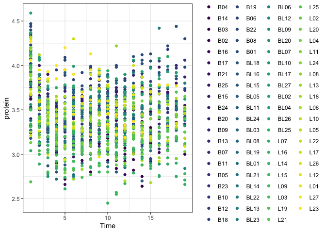
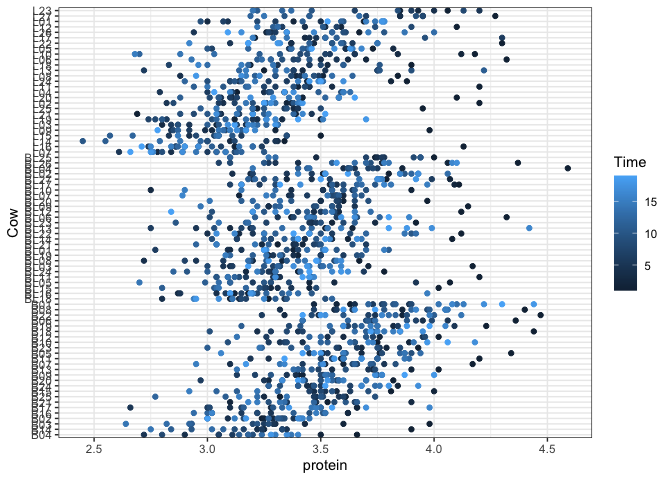
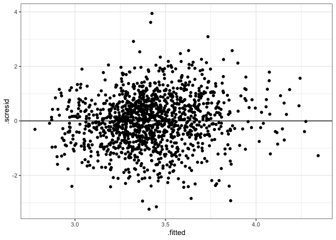
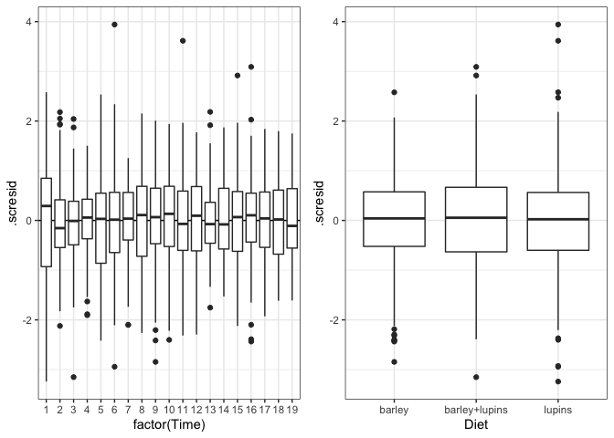
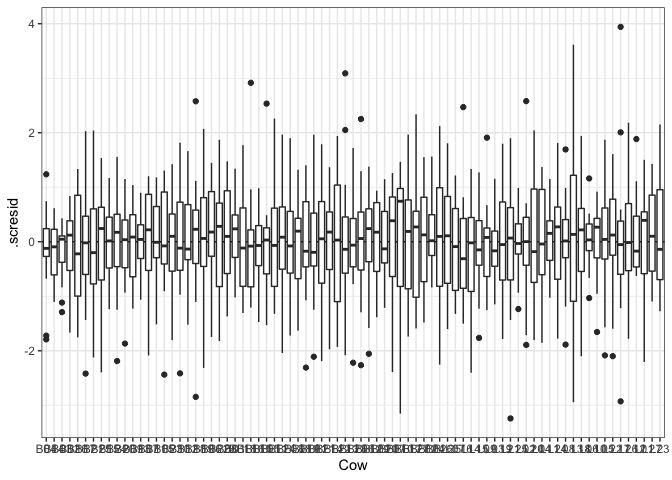
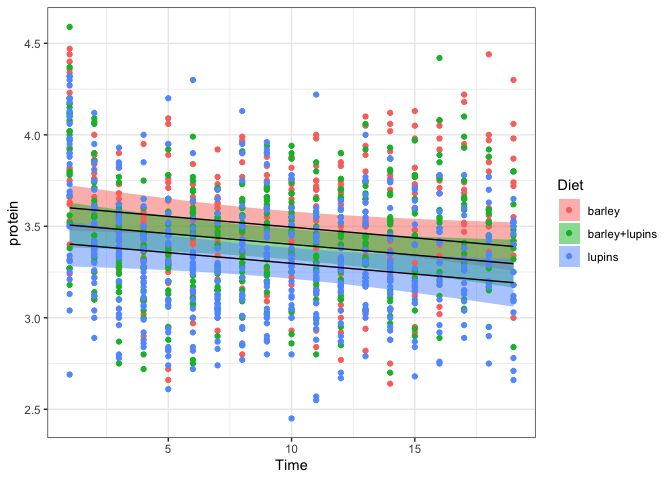

### Introduction

The protein content of cow’s milk is an important characteristic of its
nutritional value. We investigated how the protein content depends on
the cow’s diet, taking into account the time after calving, using Milk
data (Diggle et al. 1994) \[1\] from the nlme package \[2\]. The dataset
describes data on the protein content of cows’ milk in the weeks
following calving. The cattle are grouped according to whether they are
fed a diet with barley alone, with barley and lupins, or with lupins
alone.

### Methods and Materials

The presence of outliers in the data was tested using Cleveland diagrams
\[3\]. In order to assess the correlation between the variables, an
analysis was carried out using mixed linear models \[4\]. The conditions
for the applicability of the method include: 1. Linearity of the
relationship between predictor and response; 2. Normal distribution of
the response variable; 3. Homogeneity of the model residuals; 4.
Non-collinearity of the predictors.

The models were compared using the Akaike information criterion (AIC)
\[5\].

The calculations were performed in the R \[7,8\] environment using the
ggplot2 \[9\] files, cowplot \[10\] - for plotting graphs, dplyr \[11\]
- for data wrangling, lme4 \[12\] - for constructing a mixed linear
model, merTools \[13\] – to describe random effects.

### Calculations

``` r
library(nlme)
library(lme4)
library(car)
library(dplyr)
library(merTools)
library(ggplot2)
library(cowplot)
theme_set(theme_bw())

milk <- Milk
colSums(is.na(milk)) #no missing values

#size of data samples
table(milk$Diet)
table(milk$Time)

# response distribution
Pl_Cow_all  <- ggplot(milk, aes(x = Time, y = protein, colour = Cow)) + geom_point()
Pl_ind <- ggplot(milk, aes(y = Cow, x = protein, colour = Time)) + geom_point()

# collinearity of discrete and continous predictors check
Pl_coll  <- ggplot(milk, aes(x = Diet, y = Time)) + geom_boxplot()

# outliers check
Pl_outliers <- ggplot(milk, aes(y = 1:nrow(milk))) + geom_point(aes(x = protein) )

# initial models

# random intercept model
mod_random_intercept <- lmer(protein ~ Diet*Time + (1|Time) + (1|Cow), data = milk)
# random slope and intercept model
mod_random_intercept_and_slope <- lmer(protein ~ Diet*Time + (1|Time) + (1 + Time|Cow), data = milk, control = lmerControl(optimizer = 'bobyqa', optCtrl = list(maxfun = 2e5)))  
mod1_lmer <- mod_random_intercept_and_slope 
# random slope and intercept model is better according to the Akaike information criterion
icc <- performance::icc(mod1_lmer) #0.532 

# Model's validity check
mod1_lmer_diag <- data.frame(.fitted = fitted(mod1_lmer), .resid = resid(mod1_lmer, type = 'pearson'), .scresid = resid(mod1_lmer, type = 'pearson', scaled = TRUE), milk)

Pl_lmer <- ggplot(mod1_lmer_diag, aes(y = .scresid)) + geom_hline(yintercept = 0)
Pl_initial <- plot_grid(Pl_lmer + geom_point(aes(x = .fitted)), Pl_lmer + geom_boxplot(aes(x = factor(Time))), ggplot(mod1_lmer_diag, aes(y = .scresid)) + geom_boxplot(aes(x = Diet)), nrow = 1) #heteroscedasticity is abcent, time autocorrelations are mitigated

#simplifying the model
mod1_lmer_ml <- update(mod1_lmer, REML = FALSE)
drop1(mod1_lmer_ml, test = 'Chi')

mod1_lmer_ml1 <- update(mod1_lmer_ml,.~.- Diet:Time)
drop1(mod1_lmer_ml1, test = 'Chi')

mod1_lmer <- update(mod1_lmer_ml1, REML = TRUE)

AIC(mod1_lmer) # 183.94

# simplified model's validity check
mod1_lmer_diag_simpl <- data.frame(.fitted = fitted(mod1_lmer), .resid = resid(mod1_lmer, type = 'pearson'), .scresid = resid(mod1_lmer, type = 'pearson', scaled = TRUE), milk)

Pl_lmer_simpl <- ggplot(mod1_lmer_diag_simpl, aes(y = .scresid)) + geom_hline(yintercept = 0)

Pl_fitted <- Pl_lmer_simpl + geom_point(aes(x = .fitted))  #residuals are homogenuous
Pl_predictors <- plot_grid(Pl_lmer_simpl + geom_boxplot(aes(x = factor(Time))),
          ggplot(mod1_lmer_diag_simpl, aes(y = .scresid)) + geom_boxplot(aes(x = Diet)),
          nrow = 1)
Pl_cow <- Pl_lmer_simpl + geom_boxplot(aes(x = Cow))

# Model's predictions visualisation
new_data_lmer <- milk %>% group_by(Diet, Cow) %>%
  do(data.frame(Time = seq(min(.$Time), max(.$Time))))
X_lmer <- model.matrix(~ Diet + Time, data = new_data_lmer)
b_lmer <- fixef(mod1_lmer)
new_data_lmer$fit <- X_lmer%*%b_lmer
# standard errors
new_data_lmer$se <- sqrt( diag(X_lmer %*% vcov(mod1_lmer) %*% t(X_lmer)) )
new_data_lmer$lwr <- new_data_lmer$fit - 2 * new_data_lmer$se
new_data_lmer$upr <- new_data_lmer$fit + 2 * new_data_lmer$se

# model's fixed part predictions:
Pl_fix <- ggplot(new_data_lmer, aes(x = Time, y = fit))  +
  geom_ribbon(aes(ymax = upr, ymin = lwr, fill = Diet), alpha = 0.5) +
  geom_point(data = milk, aes(y = protein, colour = Diet)) +
  geom_line(aes(group = Diet)) + 
  labs(y = 'protein')

# predictions for each cow - i.e. for each level of the random factor:
new_data_lmer$fit_cow <- predict(mod1_lmer, new_data_lmer, type = 'response')

Pl_Cow <- ggplot(new_data_lmer, aes(x = Time, y = fit_cow)) + geom_line(aes(colour = Cow)) + geom_point(data = milk, aes(x = Time, y = protein, colour = Cow)) + guides(colour = guide_legend(ncol = 2)) + geom_ribbon(alpha = 0.3, aes(ymin = lwr, ymax = upr)) + facet_grid(Diet~.)

# test for fixed effects - comparison of models by AIC

mod1_lmer_ml <- update(mod1_lmer, REML = FALSE)
mod1_lmer_ml_Diet <- update(mod1_lmer_ml, .~.-Diet)
mod1_lmer_ml_Time <- update(mod1_lmer_ml, .~.-Time)

aics_Diet <- AIC(mod1_lmer_ml, mod1_lmer_ml_Diet) # 161.46 - 172.09 cannot drop Diet as AIC will rise
aics_Time <- AIC(mod1_lmer_ml, mod1_lmer_ml_Time)  # 161.46 - 164.30 cannot drop Time as AIC will rise

# Random effects
Pl_random <- plotREsim(REsim(mod1_lmer, n.sims = 100), stat = 'median', sd = TRUE)
```

The data consists of 1337 observations, which are distributed by Diet
factor levels and by weekly observations as follows:

    ## 
    ##        barley barley+lupins        lupins 
    ##           425           459           453

    ## 
    ##  1  2  3  4  5  6  7  8  9 10 11 12 13 14 15 16 17 18 19 
    ## 79 78 79 79 78 79 77 77 77 78 78 79 78 79 59 50 46 46 41

Let’s evaluate the distribution of the response variable “protein”
against the expected normal distribution:


Distributions of the response variable “protein” against time and
against the grouping factor Cow:

**Figure 1** Distributions of the protein response variable against time
and against cows.



Collinearity tests for the continuous and discrete predictors and for
outliers in the data did not reveal any violations (Figures 2, 3).

**Figure 2** Predictors are not collinear:


**Figure 3** Outliers are absent:


We constructed a model with random intercept and a model with random
slope and intercept. The random parts of both models reflect the fact
that in this case, the time after calving will also be a cause of
variability, along with the grouping factor Cow - that is, we have
crossed random effects. A comparison of the Akaike information criteria
showed that the latter model is better:

    ##                                df    AIC
    ## mod_random_intercept            9 345.62
    ## mod_random_intercept_and_slope 11 202.65

Close examinations of the model did not reveal any violations. The
residuals of the model with predicted values and the residuals of the
model with the predictors are distributed homogeneously (Figure 4).

**Figure 4** The graph of the dependence of the residuals on the
predicted values



Since the interaction of the Diet and Time predictors turned out to be
statistically insignificant, the model was simplified, the conditions of
applicability were not violated. The sizes of random effects have the
following shape:

**Figure 5** Ranges of random effects


The test for fixed effects showed that the Diet and Time predictors are
statistically significant (Table 2).

**Table 2** The test for fixed effects

    ##                   df    AIC
    ## mod1_lmer_ml       9 161.46
    ## mod1_lmer_ml_Diet  7 172.09

    ##                   df    AIC
    ## mod1_lmer_ml       9 161.46
    ## mod1_lmer_ml_Time  8 164.30

### Discussion and Results

The final model has the following shape:

**Table 3** Final simplified model

    ## lmer(formula = protein ~ Diet + Time + (1 | Time) + (1 + Time | 
    ##     Cow), data = milk, REML = TRUE, control = lmerControl(optimizer = "bobyqa", 
    ##     optCtrl = list(maxfun = 200000)))

Fixed effects are described by the expression
*p**r**o**t**e**i**n*<sub>*i*</sub> = 3.613 − 0.094 \* *D**i**e**t*<sub>*b**a**r**l**e**y* + *l**u**p**i**n**s*, *i*</sub> − 0.198 \* *D**i**e**t*<sub>*l**u**p**i**n**s*, *i*</sub> − 0.018 \* *T**i**m**e*<sub>*i*</sub>

**Figure 6** The graph of grouped predictions



**Figure 7** Graphs of individual predictions for cows


### Conclusions

According to the obtained results, the protein content in milk
correlates with the cow’s diet and on the time passed after calving
(Akaike information criterion test). For cows on a mixed diet (barley +
lupins) and for cows that ate only lupins, the protein content in milk
was lower by 0.094 and 0.198 percentage points respectively, than for
cows that were fed only with barley. At the same time, the more time
passed after calving, the less protein the cow’s milk contained (Akaike
information criterion test).

### References

\[1\]. Dataset Milk (Diggle, P., Liang, K. Y., & Zeger, S. L. (1994).
Longitudinal data analysis. New York: Oxford University Press, 5, 13.)

\[2\]. Pinheiro J. et al. (2021) Package ‘nlme’, version 3.1-152 URL
<https://cran.r-project.org/web/packages/nlme/nlme.pdf>

\[3\]. Chang W. R Graphics Cookbook, 2nd edition ISBN-10: 1491978600 URL
<https://r-graphics.org>

\[4\]. Wikipedia contributors. (2021, May 15). Mixed model. In
Wikipedia, The Free Encyclopedia. Retrieved 19:38, Jume 03, 2021, from
<https://en.wikipedia.org/wiki/Mixed_model>

\[5\]. Wikipedia contributors. (2021, March 20). Akaike information
criterion. In Wikipedia, The Free Encyclopedia. Retrieved 19:38, May 16,
2021, from <https://en.wikipedia.org/wiki/Akaike_information_criterion>

\[7\]. R Core Team. (2018). R: A language and environment for
statistical computing. R Foundation for Statistical Computing, Vienna,
Austria. URL <http://www.R-project.org/>.

\[8\]. RStudio (2018). RStudio: Integrated development environment for R
(Version 1.1.453). Boston, MA. URL <http://www.rstudio.org/>

\[9\]. Wickham, H. (2016). ggplot2: elegant graphics for data analysis.
Springer.

\[10\]. Wilke C. (2020) Introduction to cowplot. package version 1.1.1
URL
<https://cran.r-project.org/web/packages/cowplot/vignettes/introduction.html>

\[11\]. (2021) dplyr: A Grammar of Data Manipulation. package version
1.0.5 URL <https://cran.r-project.org/web/packages/dplyr/index.html>

\[12\]. (2021) lme4: Linear Mixed-Effects Models using ‘Eigen’ and S4.
package version 1.1-27 URL
<https://cran.r-project.org/web/packages/lme4/index.html>

\[13\]. (2020) merTools: Tools for Analyzing Mixed Effect Regression
Models. package version 0.5.2 URL
<https://cran.r-project.org/web/packages/merTools/index.html>
